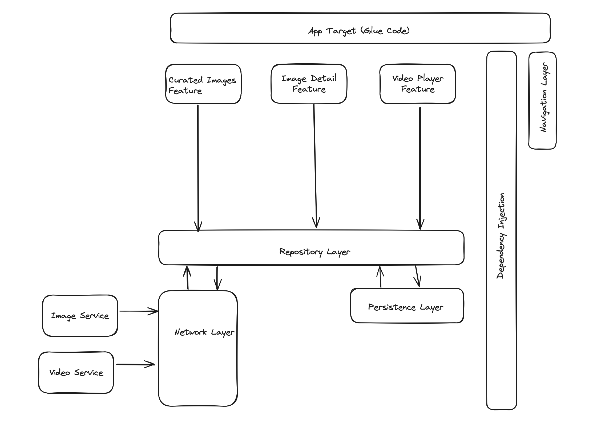
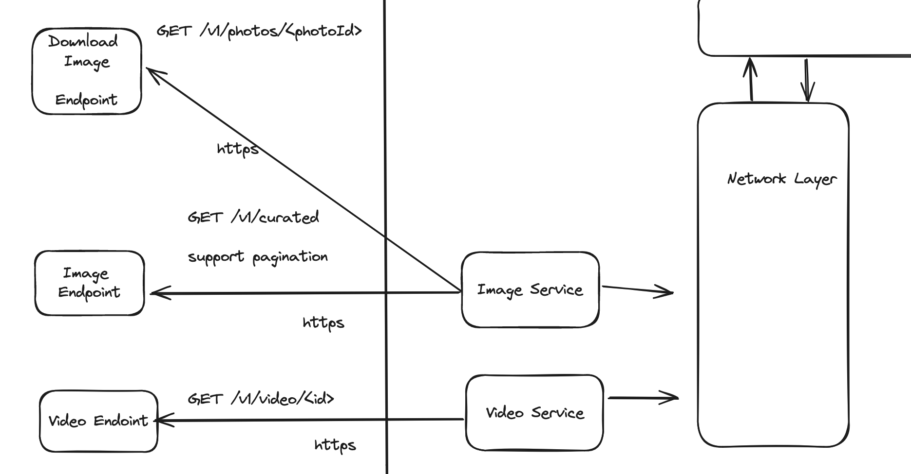

# Pexels App

## Requirements

Functional requirements
* The user should be able to see a list of curated images
* The user should be able to see the detail of the image and a high res image
* The user should be able to play a random video
* The user should be able to see if they are online or offline

Non Functional requirements
* Support offline mode
* Store up to 50MB worth of images in disk

Out of scope
* Store videos locally

## High Level Diagram
Architecture overview of the app:



Network overview:


## Low Level Design
In order to support offline mode and hide complexity, we will be consuming 
the images and video through the `Repository Layer`.

This Layer will also be in charge of syncing the local storage.

```
ImagesRepository
+ func getImages(page: Int): Observable<[ImageMetadata]>
+ func downloadImage(id: UUID): Observable<Data>
```

When the repository loads the images, it will overwrite the previous images with the batch
we just received. If the `RepositoryLayer` can't make the request due to connectivity issues,
it will serve the images from local repo.

Additionally, we can create a stream to get notifications on the connectivity status:
```
NetworkConnectionStream
+ status: Observable<Status>
```

## Screenshots
| Photo list | Photo detail | Video detail |
|------------|--------------|--------------|
|  |  |  |

## How to run the project
1. You will need to generate an API key from pexels [here](https://help.pexels.com/hc/en-us/articles/900004904026-How-do-I-get-an-API-key)
2. Open [PexelsApp.swift](apps/PexelsApp/PexelsApp/PexelsApp.swift) and look for this line:
```swift
lazy var httpClient: HTTPClient = HTTPClientImpl(apiKey: ProcessInfo.processInfo.environment["PEXELS_API_KEY"] ?? "")
```
You can pass your API key as a string:
```swift
lazy var httpClient: HTTPClient = HTTPClientImpl(apiKey: "MY_API_KEY")
```

## How to test

The project is divided in:
* `app`: Contains the glue code for all the features and dependencies
* `library`: Contains the features + business logic

The tests can be found in `library/`. If you want to run only unit tests, you can do the following:

```
cd libraries & swift test
```

If you want to run all the tests, including snapshot tests, you will need to install [git-lfs](https://git-lfs.com/) first
to download the images in the `__Snapshots__` folder. After that you can run:
```
cd libraries & ./test.sh
```

## Code Coverage

